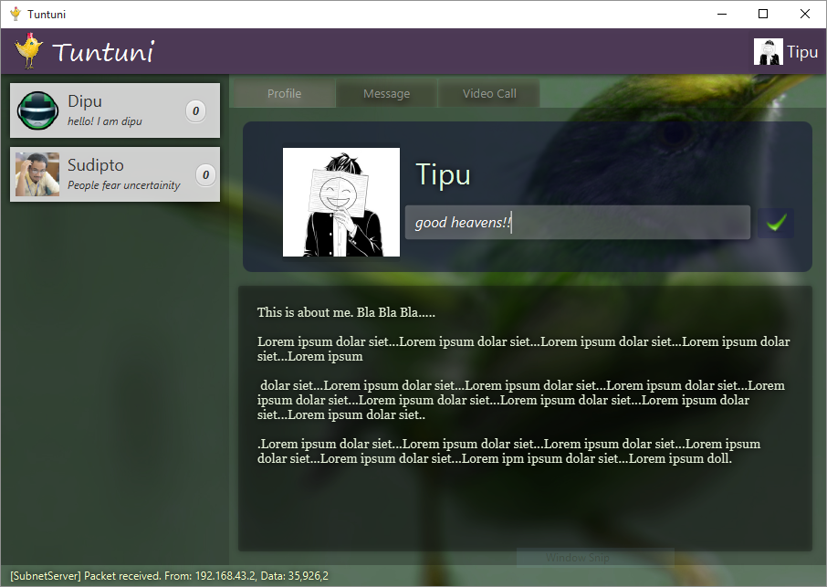

# Tuntuni

**Tuntuni** is an application for peer to peer real time video conferencing and messaging within local network. 

## Features  
- Automatically discover connected users
- Real time video conferencing
- Simple text messaging.
- Attractive user interface.

## System requirements
- Webcam 
- Microphone 
- Java 1.8 or higher
- At least 10mbps connection speed

